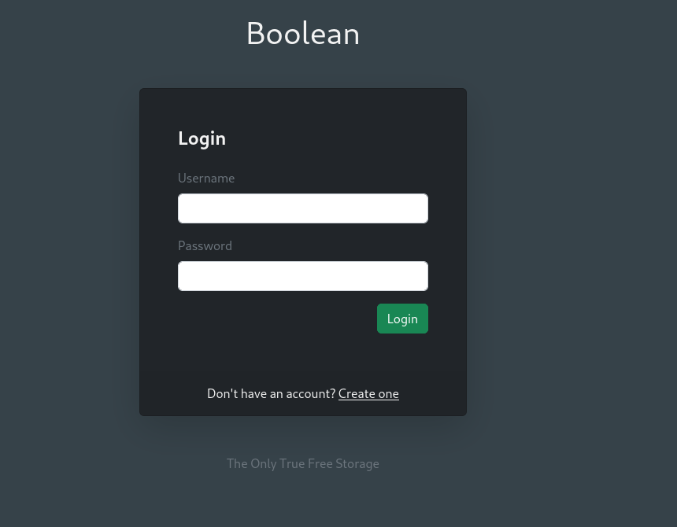
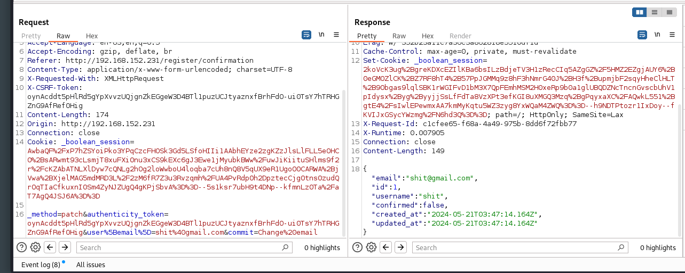
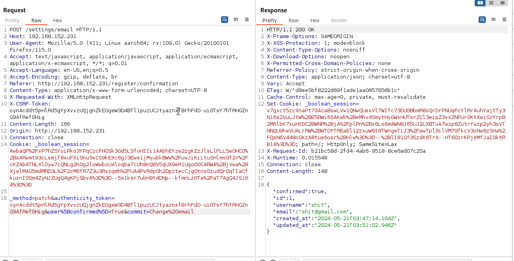

# Boolean — OffSec Proving Grounds Walkthrough

**Platform:** Proving Grounds Practice
**Difficulty:** Intermediate
**OS:** Linux

---

## TL;DR

Web app with broken access control → mass assignment to bypass email confirmation → LFI via file manager to extract SSH keys → upload own authorized_keys → find root SSH key in user's home → root.

---

## Enumeration

Full nmap scan:

```bash
sudo nmap -sS -p- -n -Pn -sV --min-rate=9362 192.168.183.231
```

**Open Ports:**
| Port | Service | Version |
|------|---------|---------|
| 22 | SSH | OpenSSH 7.9p1 Debian |
| 80 | HTTP | (web app) |
| 3000 | PPP | Closed |
| 33017 | HTTP | Apache httpd 2.4.38 |

Two web servers — port 80 has a web application and port 33017 has an Apache server. Let's enumerate both with gobuster.

**Port 80:**
```bash
gobuster dir -u http://192.168.183.231/ -w /usr/share/wordlists/dirb/common.txt
```

Key findings:
- `/login` — Login page
- `/register` — Registration page
- `/filemanager` — Redirects to login

**Port 33017:**
```bash
gobuster dir -u http://192.168.183.231:33017/ -w /usr/share/wordlists/dirb/common.txt
```

Key findings:
- `/admin` — Admin panel
- `/info` — Info directory

Port 80 looks more interesting with that file manager. Let's focus there.

---

## Exploitation — Mass Assignment to Bypass Confirmation

Visiting the login page, we're presented with a standard login form with a registration link.



We register an account and try to log in, but we're blocked. Let's fire up **Burp Suite** and intercept the profile update request to see what's going on.



In the request body, we can see a `confirmed` field set to `false`. That's what's blocking us. Classic **mass assignment vulnerability** — the application isn't properly filtering which fields the user can modify.

Send the request to Repeater and change the `email` field name to `confirmed` with the value `True`:



Now we can log in successfully.

---

## From File Manager to SSH — LFI Chain

Once logged in, we have access to a **file manager**. We can upload files and access them via the web interface.


Looking at how file links are formed, we notice the file path is user-controllable. Let's try a **Local File Inclusion (LFI)**:


It works — we can download the `/etc/passwd` file. Now let's get more ambitious and check for SSH keys in the home directory:


We find user `remi`'s home directory and their `.ssh` folder. There are some keys there, but unfortunately they don't work for login directly.

**Plan B:** Generate our own SSH key pair and upload the **public key** as `authorized_keys` to remi's `.ssh` directory via the file manager:

```bash
ssh-keygen
```

Upload the public key as `authorized_keys` through the LFI/file manager functionality. Now SSH in:

```bash
ssh -i remi remi@192.168.150.231
```

We're in as `remi`.

---

## Privilege Escalation — Root SSH Key

Poking around remi's home directory, there's a hidden gem:

```
/home/remi/.ssh/keys
```

Inside this directory, there's a **root SSH key**. We can use it to escalate:

```bash
ssh -l root -i ~/.ssh/keys/root 127.0.0.1 -o IdentitiesOnly=true
```

The `-o IdentitiesOnly=true` flag ensures SSH only uses the key we're specifying and doesn't try other identities.

**Root.** 🎉

---

## Key Takeaways

- **Mass assignment vulnerabilities** let you modify server-side fields the developer didn't intend — always check what parameters the API accepts vs. what the client sends
- **LFI in file managers** is a classic attack vector — if file paths are user-controllable, test for directory traversal
- You can weaponize write access to `.ssh/authorized_keys` to gain SSH access without knowing a password
- **Always enumerate the home directory thoroughly** — SSH keys, scripts, and hidden files can contain escalation paths

---

*Thanks for reading! Follow for more OffSec walkthrough content.*
